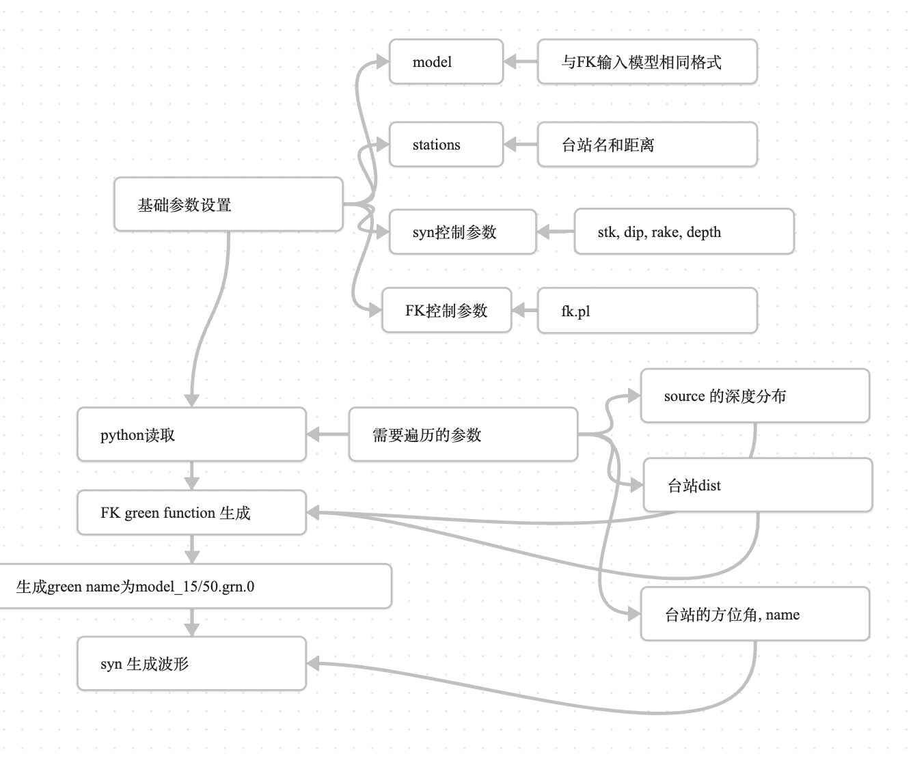

time: 2025-02-17

这部分主要是使用**FK方法**生成**某一地形下某一台站**的方法汇总。主要是为了服务于之后快速的理论波形生成。

具体使用到的程序：
- FK
- syn
- python 作为主控程序

适合区域：
- 1000km以内的台站

具体流程：

### FK详细参数
```bash
Usage: fk.pl -Mmodel/depth[/f_or_k] [-D] [-Hf1/f2] [-Nnt/dt/smth/dk/taper] [-Ppmin/pmax[/kmax]] [-Rrdep] [-SsrcType] [-Uupdn] [-Xcmd] distances ...

-M: model name and source depth in km. f triggers earth flattening (off), k indicates that the 3rd column is vp/vs ratio (vp).

    model has the following format (in units of km, km/s, g/cm3):

thickness vs vp_or_vp/vs [rho Qs Qp]

rho=0.77 + 0.32*vp if not provided or the 4th column is larger than 20 (treated as Qs).

Qs=500, Qp=2*Qs, if they are not specified.

If the first layer thickness is zero, it represents the top elastic half-space.

Otherwise, the top half-space is assumed to be vacuum and does not need to be specified.

The last layer (i.e. the bottom half space) thickness should be always be zero.

-D: use degrees instead of km (off).

-H: apply a high-pass filter with a cosine transition zone between freq. f1 and f2 in Hz (0/0).

-N: nt is the number of points, must be 2^n (256).

    Note that nt=1 will compute static displacements (require st_fk compiled).

              nt=2 will compute static displacements using the dynamic solution.

    dt is the sampling interval (1 sec).

    smth makes the final sampling interval to be dt/smth, must be 2^n (1).

    dk is the non-dimensional sampling interval of wavenumber (0.3).

    taper applies a low-pass cosine filter at fc=(1-taper)*f_Niquest (0.3).

-P: specify the min. and max. slownesses in term of 1/vs_at_the_source (0/1)

    and optionally kmax at zero frequency in term of 1/hs (15).

-R: receiver depth (0).

-S: 0=explosion; 1=single force; 2=double couple (2).

-U: 1=down-going wave only; -1=up-going wave only (0).

-X: dump the input to cmd for debug (fk).

Examples

* To compute Green's functions up to 5 Hz with a duration of 51.2 s and at a dt of 0.1 s every 5 kms for a 15 km deep source in the HK model, use

fk.pl -Mhk/15/k -N512/0.1 05 10 15 20 25 30 35 40 45 50 55 60 65 70 75 80

* To compute static Green's functions for the same source, use

fk.pl -Mhk/15/k -N2 05 10 15 20 25 30 35 40 45 50 55 60 65 70 75 80 > st.out

or use

fk.pl -Mhk/15/k -N1 05 10 15 20 25 30 35 40 45 50 55 60 65 70 75 80 > st.out

* To compute Green's functions every 10 degrees for a 10 km deep source in the PREM model.

fk.pl -Mprem/10/f -N512/5 -H0.01/0.02 -D 10 20 30 40 50 60
```

写在python文件中读取时候差异：
- 去除了f_or_k选项，使用的时候需要额外修改
- 去除了source_type选项，默认生成0 爆炸源和2 double couple成分
- 一定需要输入的参数：model, depth, nt, dt，depth_min, depth_max, depth_step，其余的可以写None作为默认

### syn详细参数
```
Usage: syn -Mmag([[/Strike/Dip]/Rake]|/Mxx/Mxy/Mxz/Myy/Myz/Mzz) -Aazimuth ([-SsrcFunctionName | -Ddura[/rise]] [-Ff1/f2[/n]] [-I | -J] -OoutName.z -G_or_TFirstCompOfGreen | -P)

   Compute displacements in cm in the up, radial (outward), and transverse (clockwise) directions produced by different seismic sources

   -M Specify source magnitude and orientation or moment-tensor

      For double-couple, mag is Mw, strike/dip/rake are in A&R convention

      For explosion; mag in in dyne-cm, no strike, dip, and rake needed

      For single-force source; mag is in dyne, only strike and dip are needed

      For moment-tensor; mag in dyne-cm, x=N,y=E,z=Down

   -A Set station azimuth in degree measured from the North

   -D Specify the source time function as a trapezoid,

      give the total duration and rise-time (0-0.5, default 0.5=triangle)

   -F apply n-th order Butterworth band-pass filter, SAC lib required (off, n=4, must be < 10)

   -G Give the name of the first component of the FK Green function

   -I Integration once

   -J Differentiate the synthetics

   -O Output SAC file name

   -P Compute static displacement, input Green functions from stdin in the form

distance Z45 R45 T45 ZDD RDD TDD ZSS RSS TSS [distance ZEX REX TEX]

      The displacements will be output to stdout in the form of

distance azimuth z r t

   -Q Convolve a Futterman Q operator of tstar (no)

   -S Specify the SAC file name of the source time function (its sum. must be 1)

   -T Give the name of the first component of 18 MT Greens functions

   Examples:

   * To compute three-component velocity at N33.5E azimuth from a Mw 4.5

earthquake (strike 355, dip 80, rake -70), use:

syn -M4.5/355/80/-70 -D1 -A33.5 -OPAS.z -Ghk_15/50.grn.0

   * To compute the static displacements from the same earthquake, use:

nawk '$1==50' st.out | syn -M4.5/355/80/-70 -A33.5 -P

   * To compute displacement from an explosion, use:

   syn -M3.3e20 -D1 -A33.5 -OPAS.z -Ghk_15/50.grn.a

      or

        syn -M3.3e20/1/0/0/1/0/1 -D1 -A33.5 -OPAS.z -Ghk_15/50.grn.0
```

### 代码使用
具体包含两个程序：read_config.py和main.py

需要给定：
- config.ini 配置参数都在其中
- model 速度模型，与FK使用的相同，['thickness', 'vs', 'vp', 'rho']
```python
0.310 2.72 4.58 2.47

0.300 3.00 5.05 2.54

0.400 3.23 5.46 2.61

1.000 3.36 5.68 2.65

1.000 3.46 5.89 2.69

2.700 3.51 5.97 2.71

4.300 3.58 5.97 2.74

4.700 3.65 6.23 2.77
```
- station 使用到的台站，各列为['station_name', 'dist', 'az']
```python
S1 200 20.5

S2 214 220

S3 300 240

S4 400 40
```